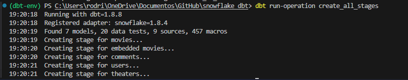
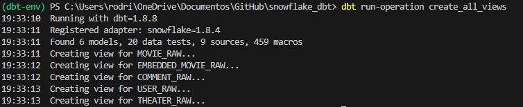
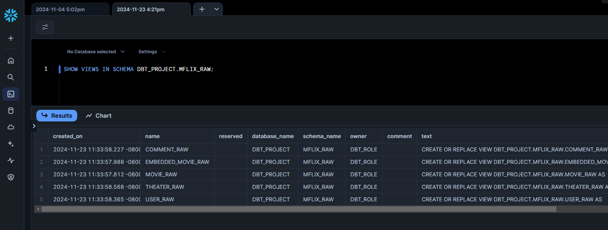
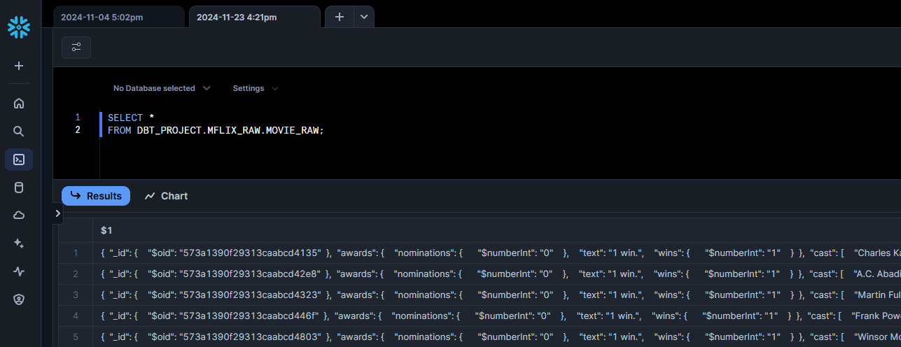
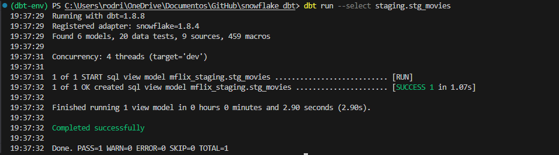
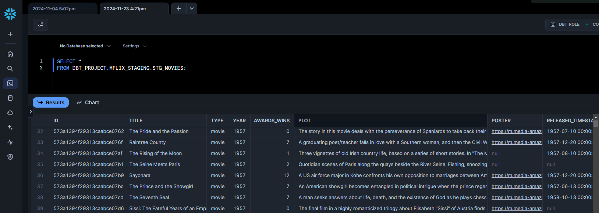
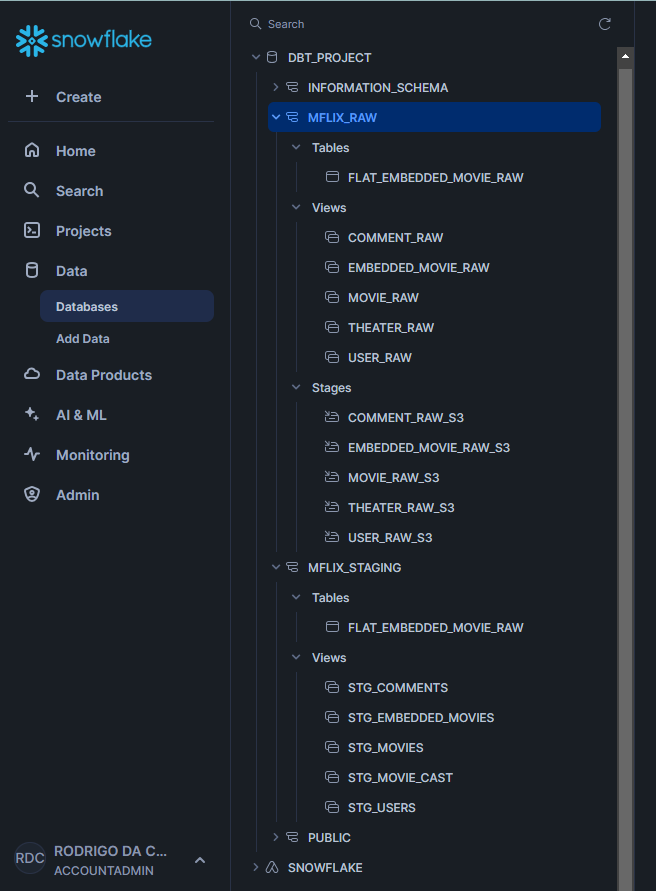

# DBT + Snowflake Project for MongoDB Mflix JSON Files

This project uses **DBT (Data Build Tool)** and **Snowflake** to manage and process raw JSON data exported from the **MongoDB Mflix dataset**. The dataset is stored in **Amazon S3**, and this project automates the creation of **stages** and **views** in Snowflake to enable querying and analysis of the raw data.

## 📄 Project Overview

The main goals of this project are:
1. **Automate Stage Creation**: Dynamically create Snowflake stages pointing to raw JSON files stored in S3.
2. **Simplify Data Access**: Generate views in Snowflake to enable easy querying of the raw data directly from the stages.
3. **Leverage DBT**: Use DBT macros to handle repetitive tasks, making the workflow modular and reusable.

The project focuses on the following **Mflix collections**, which represent the raw data stored in S3. These collections are also available in the [`S3_raw_files`](./S3_raw_files) folder of this repository for reference:

- **`movies`**: Raw JSON data for movies.
- **`comments`**: User comments on movies.
- **`embedded_movies`**: Embedded movie data with nested fields.
- **`users`**: User profile information.
- **`theaters`**: Details of theaters showing movies.

## 📂 Project Structure

## 📌 Automating Stage and View Creation Using Macros

The process of creating stages and views has been automated to simplify the ingestion and querying of raw JSON files. Instead of manually defining Snowflake resources for each collection, DBT macros were developed to:

1. **Reduce Manual Effort**: Eliminate the need to manually create stages and views for every new dataset.
2. **Enhance Consistency**: Ensure all stages and views adhere to a standardized structure and naming convention.
3. **Improve Reusability**: Enable seamless extension of the project to accommodate additional collections or datasets in the future.

The macros used for this process can be found in the [`macros`](./macros) folder.

### ▶️ Running the DBT Macro to Create Stages in Snowflake:

Result of the DBT Macro Execution:

### ▶️ Running the DBT Macro to Create Views in Snowflake:

Result of the DBT Macro Execution:

### ✅ Now we can query the JSON files stored in S3 directly in Snowflake using previous view like this:

### 🚀 Transforming JSON Data into a Structured Format

In this part of the project, the results are saved into a **staging layer**, where the raw JSON data is transformed into a structured format. The **raw layer** serves as the source of truth, containing unaltered data as it was ingested from S3. The **staging layer** applies transformations, cleaning, and formatting to prepare the data for analysis.

#### Why Use a Raw and Staging Layer?

1. **Separation of Concerns**: The raw layer ensures that the original data remains untouched and can be reprocessed if necessary, while the staging layer handles transformations.
2. **Data Traceability**: By maintaining the raw data, we can always trace back any processed data to its original form, ensuring accuracy and consistency.
3. **Flexibility for Transformations**: The staging layer allows us to focus on cleaning and structuring the data without modifying the raw source, enabling iterative improvements.

#### Focusing on the Movies Dataset

To simplify the explanation and avoid unnecessary repetition, we will focus on the **movies dataset** for the remaining examples. The same principles and transformations can be applied to other datasets like `comments`, `users`, and `theaters`.

---

The raw JSON data retrieved from the views contains one JSON object per row, as shown above. To make this data more accessible for analysis, we apply a transformation step using DBT. This step parses the JSON data and converts it into a structured tabular format, while performing several data cleaning operations.

#### 🧹 Types of Data Cleaning Applied

The following types of data cleaning were performed in the [`stg_movies.sql`](./models/staging/stg_movies.sql) file:

1. **Type Casting**:
   - Converted JSON fields into appropriate Snowflake data types, such as `string`, `int`, and `timestamp`.
   - Example: `REGEXP_REPLACE($1:"year"::string, '[^0-9]', '')::int` ensures the `year` field contains only numeric values.

2. **Date and Time Parsing**:
   - Extracted and converted timestamp values from nested JSON structures.
   - Example: `TO_TIMESTAMP(GET_PATH($1:"released"['$date'], OBJECT_KEYS($1:"released"['$date'])[0])::bigint / 1000)` converts UNIX timestamps to Snowflake `TIMESTAMP`.

3. **Nested JSON Extraction**:
   - Used Snowflake functions like `GET_PATH` to access deeply nested fields.
   - Example: `GET_PATH($1:"awards"['wins'], OBJECT_KEYS($1:"awards"['wins'])[0])::int` retrieves the number of awards won.

4. **Text Processing**:
   - Flattened array fields into comma-separated strings for easier querying and display.
   - Example: `ARRAY_TO_STRING($1:"cast"::array, ', ')` converts the `cast` array into a single `cast_str` string.

5. **Data Deduplication**:
   - Removed duplicate entries based on the `title` field, ensuring unique movie records in the final output.
   - Example: `AND NOT EXISTS (SELECT 1 FROM raw_data d WHERE r.title = d.title AND r.id != d.id)` eliminates duplicates by comparing IDs.

6. **Error Handling for Nested Objects**:
   - Managed cases where nested objects have inconsistent structures by using `OBJECT_KEYS` to dynamically access keys.

#### ▶️ Running the DBT Model to Transform Movie Data:

#### ✅ Result of the DBT Transformation Step:

With the transformation complete, the movie data is now in a tabular format, ready for querying and further analysis.

---

#### 🧹 Breaking Down Multi-Value Columns into Multiple Rows

In addition to parsing and cleaning the main `movies` dataset, we created a staging entity to handle columns containing **comma-separated text**. For example, the `cast` field in the `movies` dataset contains multiple cast members as a single array. To enable more granular analysis, we transformed this into a **row-per-value structure**.

This step is implemented in the [`stg_movie_cast.sql`](./models/staging/stg_movie_cast.sql) file.

#### Why Perform This Step?

1. **Granular Analysis**: By transforming multi-value fields like `cast` into a row-per-value format, we can analyze individual elements more effectively (e.g., analyzing the frequency of actors across movies).
2. **Easier Aggregations**: Having a normalized structure simplifies aggregations and filtering for reports or visualizations.
3. **Data Integrity**: Ensures that no individual value is lost or overlooked due to being embedded in a larger text or array field.

### Snowflake Database:

