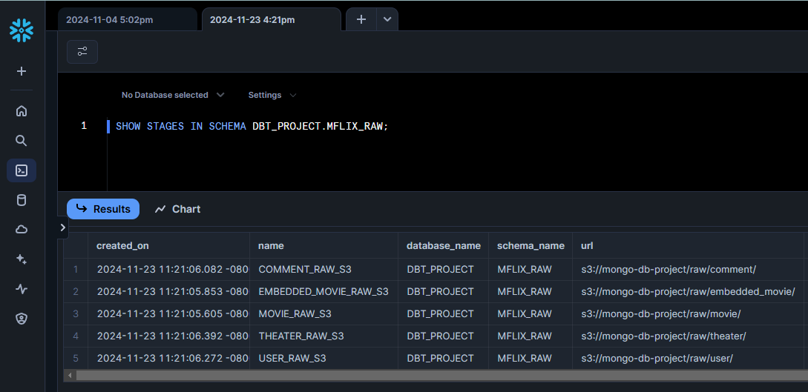

# DBT + Snowflake Project for MongoDB Mflix JSON Files

This project uses **DBT (Data Build Tool)** and **Snowflake** to manage and process raw JSON data exported from the **MongoDB Mflix dataset**. The dataset is stored in **Amazon S3**, and this project automates the creation of **stages** and **views** in Snowflake to enable querying and analysis of the raw data.

## 📄 Project Overview

The main goals of this project are:
1. **Automate Stage Creation**: Dynamically create Snowflake stages pointing to raw JSON files stored in S3.
2. **Simplify Data Access**: Generate views in Snowflake to enable easy querying of the raw data directly from the stages.
3. **Leverage DBT**: Use DBT macros to handle repetitive tasks, making the workflow modular and reusable.

The project focuses on the following **Mflix collections**, which represent the raw data stored in S3. These collections are also available in the [`S3_raw_files`](./S3_raw_files) folder of this repository for reference:

- **`movies`**: Raw JSON data for movies.
- **`comments`**: User comments on movies.
- **`embedded_movies`**: Embedded movie data with nested fields.
- **`users`**: User profile information.
- **`theaters`**: Details of theaters showing movies.

## 📂 Project Structure

## 📌 Automating Stage and View Creation Using Macros

The process of creating stages and views has been automated to simplify the ingestion and querying of raw JSON files. Instead of manually defining Snowflake resources for each collection, DBT macros were developed to:

1. **Reduce Manual Effort**: Eliminate the need to manually create stages and views for every new dataset.
2. **Enhance Consistency**: Ensure all stages and views adhere to a standardized structure and naming convention.
3. **Improve Reusability**: Enable seamless extension of the project to accommodate additional collections or datasets in the future.

### ▶️ Running the DBT Macro to Create Stages in Snowflake:

Result of the DBT Macro Execution:

### ▶️ Running the DBT Macro to Create Views in Snowflake:

Result of the DBT Macro Execution:

### ✅ Now we can query the JSON files stored in S3 directly in Snowflake using previous view like this:

